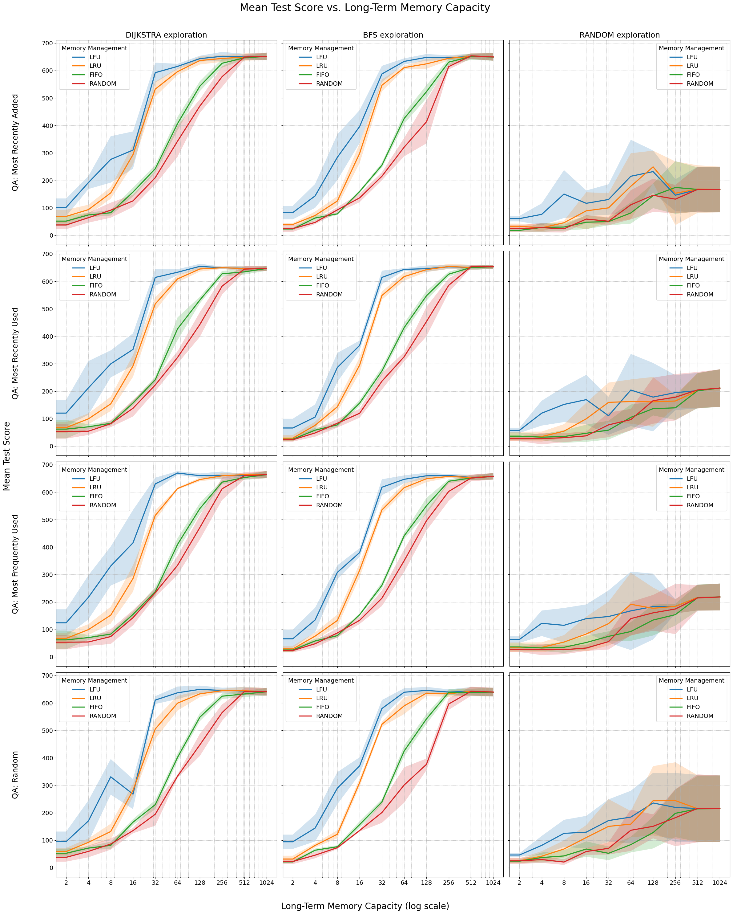

# Agent for RoomEnv-v2

This repository contains implementations of symbolic agents for the
[RoomEnv-v2](https://github.com/humemai/room-env/blob/main/README-v2.md) environment.
The environment represents a partially observable world where both the hidden state and
agent observations are represented as knowledge graphs.

## Agent Types

### ShortTermAgent

- Uses only current observations without long-term memory
- Question answering is performed via SPARQL queries on current observation
- Exploration policies: random, avoid_walls

### LongTermAgent

- Maintains both short-term and limited long-term memory
- Question answering via SPARQL queries across both memories
- Question answering policies:
  - `most_recently_added`: Prioritize memories with the most recent timestamp
  - `most_recently_used`: Prioritize memories that were accessed most recently
  - `most_frequently_used`: Prioritize memories that have been accessed most frequently
  - `random`: Randomly choose between the three policies above
- Exploration policies:
  - `random`: Choose random direction
  - `avoid_walls`: Avoid hitting walls
  - `bfs`: Use breadth-first search to find unvisited rooms
  - `dijkstra`: Use Dijkstra's algorithm with weights based on room contents
- Memory management (forget) policies:
  - `fifo`: First-In-First-Out eviction
  - `lru`: Least-Recently-Used eviction
  - `lfu`: Least-Frequently-Used eviction
  - `random`: Random eviction
- Memory management (remmeber) policies:
  - `all`: Remember everything in the short-term as long-term

## Running Experiments

The [`run-symbolic.py`](./run-symbolic.py) script allows running experiments with different configurations:

```bash
python run-symbolic.py
```

You can modify the script to adjust parameters such as:

- Seeds for reproducibility
- Room sizes
- QA policies
- Exploration policies
- Memory management (remember and forget) policies
- Memory capacities

## Experiment Results



The figure shows agent performance across different exploration strategies, long-term
memory capacities, and memory management policies. Performance consistently improves as
memory capacity increases, and structured exploration (Dijkstra, BFS) outperforms random
exploration.

The best performing set of symbolic policies are "most recently added" for question
answering, "least recently used" for long-term memory management (forget), "all" for
long-term memory management (remember) and "Dijkstra" search for maze exploration.

### Best Performing Configuration

- QA Policy: most_recently_added
- Explore Policy: dijkstra
- MM Forget Policy: lru
- MM Remember Policy: all

| Memory Size | Mean Score (± Std) |
| ----------- | ------------------ |
| 0           | 32.6 (± 11)        |
| 2           | 40.8 (± 19)        |
| 4           | 59.8 (± 3)         |
| 8           | 142.0 (± 11)       |
| 16          | 253.8 (± 76)       |
| 32          | 482.6 (± 42)       |
| 64          | 598.4 (± 26)       |
| 128         | 641.8 (± 66)       |
| 256         | 650.2 (± 23)       |
| 512         | 641.4 (± 28)       |
| 1024        | 644.2 (± 31)       |

## Implementation Approach

All policies in this repository (question answering, exploration, and memory management)
are implemented as symbolic, discrete algorithms without any learning components. This
provides a transparent baseline but leaves significant room for improvement through
reinforcement learning approaches that could adapt to specific environment dynamics.

## Contributing

Contributions are what make the open source community such an amazing place to be learn,
inspire, and create. Any contributions you make are **greatly appreciated**.

1. Fork the Project
1. Create your Feature Branch (`git checkout -b feature/AmazingFeature`)
1. Run `make test && make style && make quality` in the root repo directory, to ensure
   code quality.
1. Commit your Changes (`git commit -m 'Add some AmazingFeature'`)
1. Push to the Branch (`git push origin feature/AmazingFeature`)
1. Open a Pull Request

## Authors

- [Taewoon Kim](https://taewoon.kim/)
- [Michael Cochez](https://www.cochez.nl/)
- [Vincent Francois-Lavet](http://vincent.francois-l.be/)
