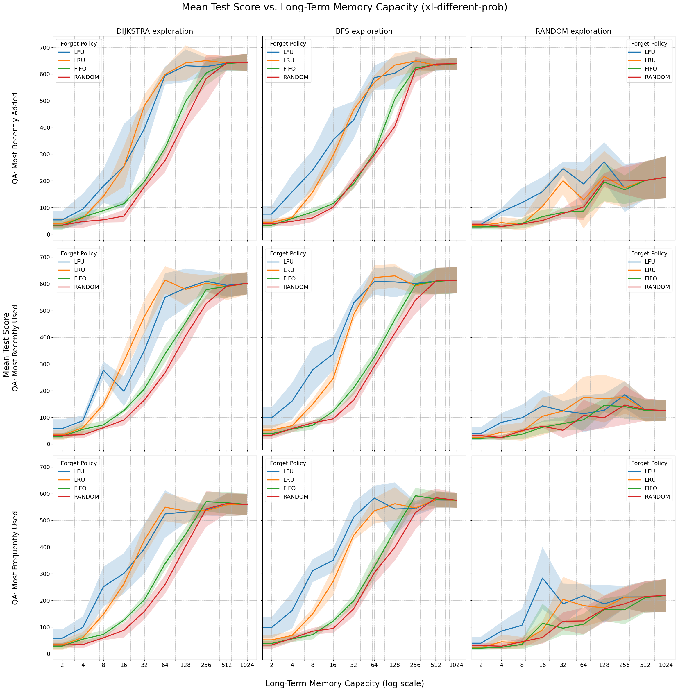

# Agent for RoomEnv-v2

This repository contains implementations of both symbolic and neural agents for the
[RoomEnv-v2](https://github.com/humemai/room-env/blob/main/README-v2.md) environment.
The environment represents a partially observable world where both the hidden state and
agent observations are represented as knowledge graphs.

## Agent Types

### Symbolic Agents

#### ShortTermAgent

- Uses only current observations without long-term memory
- Question answering is performed via SPARQL queries on current observation
- Exploration policies: random, avoid_walls

#### LongTermAgent

- Maintains both short-term and limited long-term memory
- Question answering via SPARQL queries across both memories
- Question answering policies:
  - `most_recently_added`: Prioritize memories with the most recent timestamp
  - `most_recently_used`: Prioritize memories that were accessed most recently
  - `most_frequently_used`: Prioritize memories that have been accessed most frequently
  - `random`: Randomly choose between the three policies above
- Exploration policies:
  - `random`: Choose random direction
  - `avoid_walls`: Avoid hitting walls
  - `bfs`: Use breadth-first search to find unvisited rooms
  - `dijkstra`: Use Dijkstra's algorithm with weights based on room contents
- Memory management (forget) policies:
  - `fifo`: First-In-First-Out eviction
  - `lru`: Least-Recently-Used eviction
  - `lfu`: Least-Frequently-Used eviction
  - `random`: Random eviction
- Memory management (remember) policies:
  - `all`: Remember everything in the short-term as long-term

### Neural (RL) Agents

#### DQNAgent

- Deep Q-Network agent that learns memory management and exploration policies
- Supports both shared and separate neural networks for different policies
- Two function approximator architectures available:
  - **GNN-based**: Uses Graph Neural Networks (StarE convolution) to process memory graphs
  - **Transformer-based**: Uses transformer architecture to encode memory sequences
- Learnable policies:
  - Memory management (forget): `rl` - learns when to evict specific memories
  - Memory management (remember): `rl` - learns what to remember from short-term memory
  - Can be combined with symbolic policies (e.g., `lru` forget with `rl` remember)
- Fixed policies inherited from symbolic agents:
  - Question answering: `most_recently_added`
  - Exploration: `dijkstra`

## Running Experiments

### Symbolic Agents

The [`run-symbolic.py`](./run-symbolic.py) script allows running experiments with different symbolic configurations:

```bash
python run-symbolic.py
```

### DQN Agents

The [`run-dqn.py`](./run-dqn.py) script runs DQN training experiments:

```bash
python run-dqn.py
```

You can modify these scripts to adjust parameters such as:

- Seeds for reproducibility
- Room sizes
- QA policies
- Exploration policies
- Memory management (remember and forget) policies
- Memory capacities
- Neural network architectures (GNN vs Transformer)
- Training hyperparameters

## Symbolic Agent Results



The figure shows symbolic agent performance across different exploration strategies, long-term
memory capacities, and memory management policies. Performance consistently improves as
memory capacity increases, and structured exploration (Dijkstra, BFS) outperforms random
exploration.

The best performing set of symbolic policies are "most recently added" for question
answering, "least recently used" for long-term memory management (forget), "all" for
long-term memory management (remember) and "Dijkstra" search for maze exploration.

### Best Performing Symbolic Configuration

- QA Policy: most_recently_added
- Explore Policy: dijkstra
- MM Forget Policy: lru
- MM Remember Policy: all

| Memory Size | Mean Score (± Std) |
| ----------- | ------------------ |
| 0           | 32.6 (± 11)        |
| 2           | 40.8 (± 19)        |
| 4           | 59.8 (± 3)         |
| 8           | 142.0 (± 11)       |
| 16          | 253.8 (± 76)       |
| 32          | 482.6 (± 42)       |
| 64          | 598.4 (± 26)       |
| 128         | 641.8 (± 66)       |
| 256         | 650.2 (± 23)       |
| 512         | 641.4 (± 28)       |
| 1024        | 644.2 (± 31)       |

## DQN Agent Architecture

The DQN agents support two different function approximator architectures:

### GNN-based Architecture
- Uses StarE (Star Graph Neural Network) convolution layers
- Processes memory as a knowledge graph with entities, relations, and qualifiers
- Attention-based aggregation for forget policy decisions
- Per-memory Q-value computation for remember policy decisions

### Transformer-based Architecture
- Tokenizes memory quadruples into vector representations
- Uses multi-layer transformer encoder to process memory sequences
- Supports the same policy structures as GNN architecture
- Attention-based processing of temporal memory sequences

Both architectures can be configured with either shared networks (one network handles both policies) or separate networks (dedicated networks for remember and forget policies).

## Implementation Approach

### Symbolic Agents
All policies in the symbolic agents (question answering, exploration, and memory management)
are implemented as discrete algorithms without any learning components. This
provides a transparent baseline for comparison.

### Neural Agents
The DQN agents use reinforcement learning to optimize memory management policies while
keeping question answering and exploration fixed to the best-performing symbolic policies.
This allows for direct comparison of learned vs. hand-crafted memory management strategies.

The neural agents support flexible combinations of learned and symbolic policies, enabling
systematic evaluation of which components benefit most from learning.
