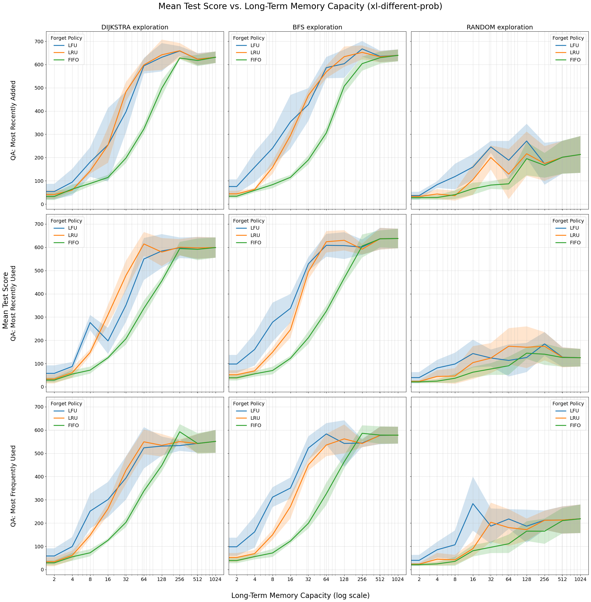

# Agent for RoomEnv-v2

This repository contains implementations of both symbolic and neural agents for the
[RoomEnv-v2](https://github.com/humemai/room-env/blob/main/README-v2.md) environment.
The environment represents a partially observable world where both the hidden state and
agent observations are represented as knowledge graphs.

## Agent Types

### Symbolic Agents

#### ShortTermAgent

- Uses only current observations without long-term memory
- Question answering is performed via SPARQL queries on current observation
- Exploration policies: random, avoid_walls

#### LongTermAgent

- Maintains both short-term and limited long-term memory
- Question answering via SPARQL queries across both memories
- Question answering policies:
  - `most_recently_added`: Prioritize memories with the most recent timestamp
  - `most_recently_used`: Prioritize memories that were accessed most recently
  - `most_frequently_used`: Prioritize memories that have been accessed most frequently
  - `random`: Randomly choose between the three policies above
- Exploration policies:
  - `random`: Choose random direction
  - `avoid_walls`: Avoid hitting walls
  - `bfs`: Use breadth-first search to find unvisited rooms
  - `dijkstra`: Use Dijkstra's algorithm with weights based on room contents
- Memory management (forget) policies:
  - `fifo`: First-In-First-Out eviction
  - `lru`: Least-Recently-Used eviction
  - `lfu`: Least-Frequently-Used eviction
  - `random`: Random eviction
- Memory management (remember) policies:
  - `all`: Remember everything in the short-term as long-term

### Neural (RL) Agents

#### DQNAgent

- Deep Q-Network agent that learns optimal policies for four different decision types
- Supports both shared and separate neural networks for different policies
- Two function approximator architectures available:
  - **GNN-based**: Uses Graph Neural Networks (StarE convolution) to process memory graphs
  - **Transformer-based**: Uses transformer architecture to encode memory sequences
- **Four Learnable Policies**:
  - **Memory management (forget)**: `rl` - learns when to evict specific memories (3 actions: lru, lfu, fifo)
  - **Memory management (remember)**: `rl` - learns what to remember from short-term memory (2 actions: remember, forget)
  - **Question answering (qa)**: `rl` - **contextual bandit** that learns which QA strategy to use (3 actions: most_recently_added, most_recently_used, most_frequently_used)
  - **Exploration (explore)**: `rl` - learns which exploration strategy to use (2 actions: dijkstra, bfs)
- **Flexible Policy Combinations**: Can mix learned and symbolic policies (e.g., `rl` forget with symbolic `dijkstra` explore)
- **Network Architecture Options**:
  - **Shared Network**: Single backbone network with separate MLP heads for each policy
  - **Separate Networks**: Dedicated networks for each learned policy
- **Four Replay Buffers**: Independent experience replay for each policy type

## Policy Details

### Question Answering (QA) Policy

The QA policy is implemented as a **contextual bandit** since QA actions don't affect the next state:
- Takes one action per environment step to answer all questions in that step
- Uses the current memory state (short + long term) as context
- Learns to predict immediate reward for each QA strategy without considering future states
- No temporal difference learning or target networks needed for this policy
- Actions correspond to different QA strategies from the symbolic agent

### Exploration Policy

The exploration policy determines which exploration strategy to use:
- Takes one action per environment step to determine movement direction
- Uses the current memory state as input
- Actions correspond to different exploration algorithms (dijkstra vs bfs)

### Memory Management Policies

- **Remember Policy**: Determines what to move from short-term to long-term memory
  - Multiple actions per step (one per short-term memory)
  - Uses independent Q-learning
- **Forget Policy**: Determines which long-term memories to evict when capacity is exceeded
  - One action per step when eviction is needed
  - Uses attention-based aggregation of memory state

## Running Experiments

### Symbolic Agents

The [`run-symbolic.py`](./run-symbolic.py) script allows running experiments with different symbolic configurations:

```bash
python run-symbolic.py
```

### DQN Agents

The [`run-dqn.py`](./run-dqn.py) script runs DQN training experiments:

```bash
python run-dqn.py
```

You can modify these scripts to adjust parameters such as:

- Seeds for reproducibility
- Room sizes
- Policy combinations (which policies to learn vs use symbolic)
- Memory capacities
- Neural network architectures (GNN vs Transformer)
- Network sharing (shared vs separate networks)
- Training hyperparameters

## Symbolic Agent Results



The figure shows symbolic agent performance across different exploration strategies, long-term
memory capacities, and memory management policies. Performance consistently improves as
memory capacity increases, and structured exploration (Dijkstra, BFS) outperforms random
exploration.

The best performing set of symbolic policies are "most recently added" for question
answering, "least recently used" for long-term memory management (forget), "all" for
long-term memory management (remember) and "Dijkstra" search for maze exploration.

### Best Performing Symbolic Configuration

- QA Policy: most_recently_added
- Explore Policy: dijkstra
- MM Forget Policy: lru
- MM Remember Policy: all

| Memory Size | Mean Score (± Std) |
| ----------- | ------------------ |
| 0           | 32.6 (± 11)        |
| 2           | 40.8 (± 19)        |
| 4           | 59.8 (± 3)         |
| 8           | 142.0 (± 11)       |
| 16          | 253.8 (± 76)       |
| 32          | 482.6 (± 42)       |
| 64          | 598.4 (± 26)       |
| 128         | 641.8 (± 66)       |
| 256         | 650.2 (± 23)       |
| 512         | 641.4 (± 28)       |
| 1024        | 644.2 (± 31)       |

## DQN Agent Architecture

The DQN agents support two different function approximator architectures:

### GNN-based Architecture

- Uses StarE (Star Graph Neural Network) convolution layers
- Processes memory as a knowledge graph with entities, relations, and qualifiers
- Attention-based aggregation for single-action policies (forget, qa, explore)
- Per-memory Q-value computation for multi-action policies (remember)

### Transformer-based Architecture

- Tokenizes memory quadruples into vector representations
- Uses multi-layer transformer encoder to process memory sequences
- Supports the same policy structures as GNN architecture
- Attention-based processing of temporal memory sequences

Both architectures can be configured with either shared networks (one network handles all policies) or separate networks (dedicated networks for each learned policy).

## Implementation Approach

### Symbolic Agents

All policies in the symbolic agents (question answering, exploration, and memory management)
are implemented as discrete algorithms without any learning components. This
provides a transparent baseline for comparison.

### Neural Agents

The DQN agents use reinforcement learning to optimize any combination of the four policy types while
keeping non-learned policies fixed to symbolic implementations. This allows for systematic
evaluation of which components benefit most from learning and enables flexible policy combinations.

The neural agents support:
- **Full RL**: All four policies learned (`qa="rl"`, `explore="rl"`, `forget="rl"`, `remember="rl"`)
- **Partial RL**: Any subset of policies learned (e.g., `qa="rl"`, `explore="dijkstra"`, `forget="lru"`, `remember="all"`)
- **Network Sharing**: Shared backbone with separate heads vs completely separate networks
- **Independent Learning**: Each policy has its own replay buffer and can be learned independently
- **Contextual Bandit QA**: QA policy uses contextual bandit learning (no temporal dependencies)

### Number of parameters by architecture type

The following tables show the number of parameters for different DQN agent configurations:

**Vanilla GCN based**

| Policies (RL) | Separate Networks | Embedding Dim | Num Layers | MLP Hidden Layers | Total Params |
| ------------- | ----------------- | ------------- | ---------- | ----------------- | ------------ |
| Forget + Remember | True | 32 | 2 | 1 | 22471 |
| Forget + Remember | True | 64 | 4 | 1 | 90247 |
| All Four | True | 32 | 2 | 1 | ~45000 |
| All Four | False (Shared) | 32 | 2 | 1 | ~25000 |

**StarE GCN based**

| Policies (RL) | Separate Networks | Embedding Dim | Num Layers | MLP Hidden Layers | Total Params |
| ------------- | ----------------- | ------------- | ---------- | ----------------- | ------------ |
| Forget + Remember | True | 32 | 2 | 1 | 39239 |
| Forget + Remember | True | 64 | 2 | 1 | 139911 |
| All Four | True | 32 | 2 | 1 | ~78000 |
| All Four | False (Shared) | 32 | 2 | 1 | ~42000 |

**Transformer-based**

| Policies (RL) | Separate Networks | Embedding Dim | Num Layers | Num Heads | MLP Hidden Layers | Total Params |
| ------------- | ----------------- | ------------- | ---------- | --------- | ----------------- | ------------ |
| Forget + Remember | True | 16 | 2 | 2 | 1 | 22983 |
| Forget + Remember | True | 32 | 4 | 4 | 1 | 133639 |
| All Four | True | 16 | 2 | 2 | 1 | ~46000 |
| All Four | False (Shared) | 16 | 2 | 2 | 1 | ~26000 |

## Policy Action Spaces

- **Remember Policy**: 2 actions (remember, forget) - applied per short-term memory
- **Forget Policy**: 3 actions (lru, lfu, fifo) - applied when memory capacity exceeded
- **QA Policy**: 3 actions (most_recently_added, most_recently_used, most_frequently_used) - **contextual bandit** applied per environment step
- **Explore Policy**: 2 actions (dijkstra, bfs) - applied per environment step

The modular design allows researchers to study the relative importance of learning different
decision-making components and their interactions in memory-augmented reinforcement learning.
The QA policy's contextual bandit formulation makes it particularly suitable for studying
immediate reward prediction without temporal dependencies.
